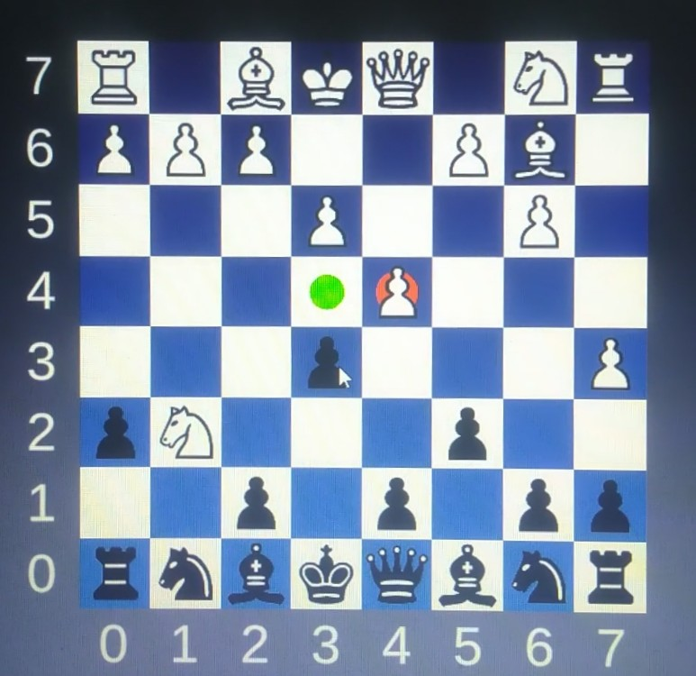
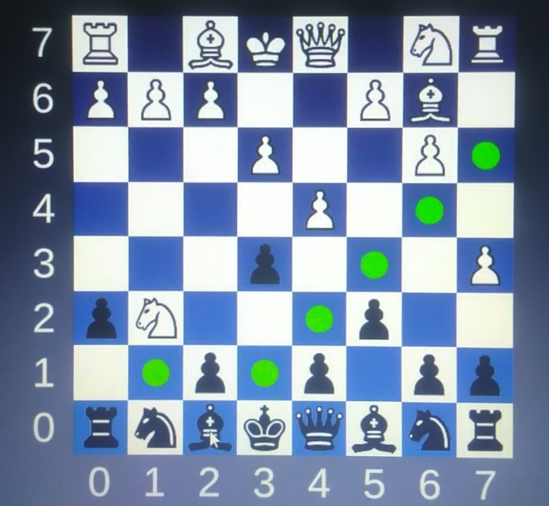
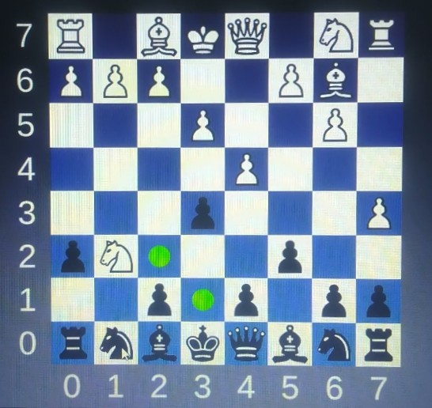
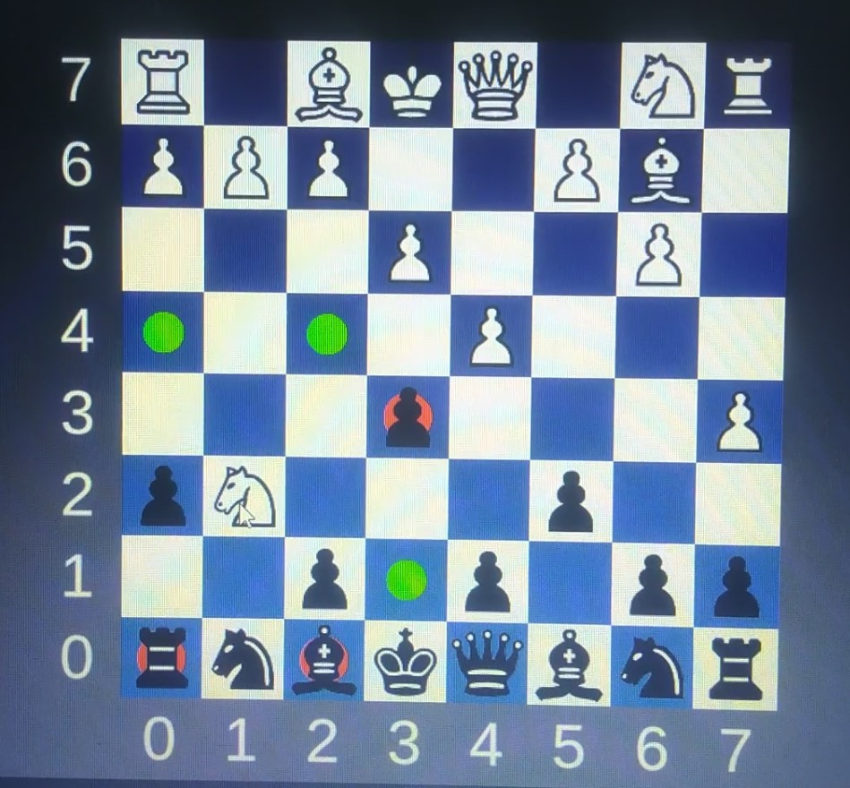
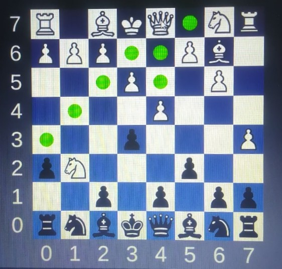
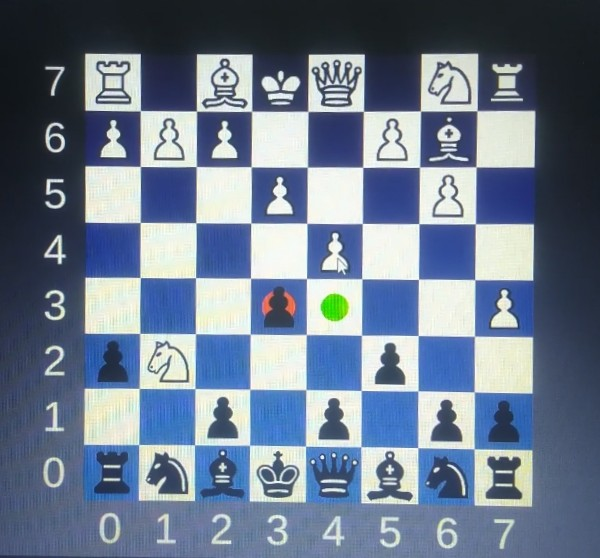

# Chess Legal Move Highlighter

This Unity project highlights all legal moves for a selected chess piece.

# What it does
- When you click on a piece, the game displays its possible moves.
- It highlights valid empty tiles.
- Opponent pieces that can be captured are marked with a red highlight.
- Clicking the same piece again will remove the highlights.

# Screenshots

  
  
  
  
  
  

